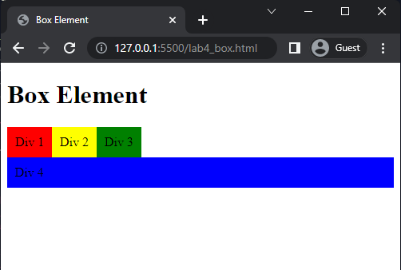

# Lab4Web

Latihan membuat layout....

## Membuat Box Element

1.  pertama buat dokumen HTML terlebih dahulu

        <!DOCTYPE html>
        <html lang="en">
        <head>
          <meta charset="UTF-8">
          <meta http-equiv="X-UA-Compatible" content="IE=edge">
          <meta name="viewport" content="width=device-width, initial-scale=1.0">
          <title>Document</title>
        </head>
        <body>

        </body>
        </html>

2.  kemudian membuat box element menggunakan tag `div`

3. menambahkan style untuk box element

maka akan menampilkan sebagai berikut

4. Mengatur Clearfix Element
   Clearfix digunakan untuk mengatur element setelah float element. Property clear digunakan untuk mengaturnya.
   Tambahkan element div lainnya seteleah div3 seperti berikut.

kemudian atur properti clear pada css sebagai berikut

kemudian buka browser dan refresh

`clear: left;`
maka akan tampil seperti gambar di bawah

`clear: right;`
maka akan tampil seperti gambar di bawah

`clear: both;`
maka akan tampil seperti gambar di bawah

