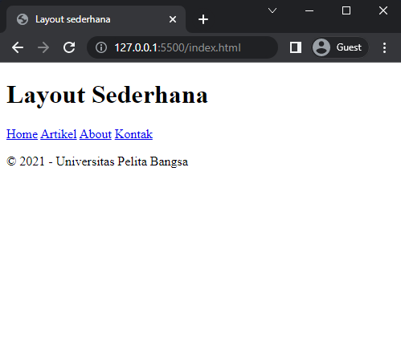
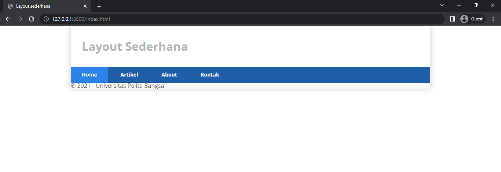

# Lab4Web

Latihan membuat layout....

**Web Layout**

Web layout merupakan kerangka yang mengatur penempatan tata letak sebuah elemen pada halaman web. Tata letak element seperti navigasi, header, tombol CTA (Call to Action), dan elemen lainnya pada halaman web, sehingga tampilan web dapat disesuaikan dengan desain yang ada. Dengan layout website yang tepat, informasi akan tampil dengan lebih menawan dan fungsional.

Halaman web sering kali dibagi menjadi header, menu, konten, dan footer: Ada banyak sekali desain tata letak yang dapat dipilih.

## Membuat Box Element

**Box Element**

Element HTML dapat dianggap sebagai sebuah Box atau kotak. Box tersebut digunakan untuk membuat layout web. Pada dasarnya semua element HTML adalah box dengan beberapa perbedaan. Ada yang floating ada juga yang tanpa floating.

Tag yang biasanya digunakan dalam merancang layout web adalah tag div dengan konsep box element. Konsep box element terdiri dari Margin, Border, Padding, dan Content.

1.  pertama buat dokumen HTML terlebih dahulu

        <!DOCTYPE html>
        <html lang="en">
        <head>
          <meta charset="UTF-8">
          <meta http-equiv="X-UA-Compatible" content="IE=edge">
          <meta name="viewport" content="width=device-width, initial-scale=1.0">
          <title>Document</title>
        </head>
        <body>

        </body>
        </html>

2.  kemudian membuat box element menggunakan tag `div`

3. menambahkan style untuk box element

maka akan menampilkan sebagai berikut

4. Mengatur Clearfix Element
   Clearfix digunakan untuk mengatur element setelah float element. Property clear digunakan untuk mengaturnya.
   Tambahkan element div lainnya seteleah div3 seperti berikut.

kemudian atur properti clear pada css sebagai berikut

kemudian buka browser dan refresh

`clear: left;`
maka akan tampil seperti gambar di bawah

`clear: right;`
maka akan tampil seperti gambar di bawah

`clear: both;`
maka akan tampil seperti gambar di bawah

## membuat tampilan layout sederhaman

1.  kita buat dokumen `HTML` terlebih dahulu

        <!DOCTYPE html>
        <html lang="en">
        <head>
          <meta charset="UTF-8">
          <meta http-equiv="X-UA-Compatible" content="IE=edge">
          <meta name="viewport" content="width=device-width, initial-scale=1.0">
          <title>Document</title>
        </head>
        <body>

        </body>
        </html>

2.  tulis kode berikut ini

maka akan menampilkan

menambahkan style

menampilkan

3. membuat navigasi

refres browser maka akan menampilkan

4. Membuat Hero Panel

tulis code HTML dan CSS sebagai berikut

maka akan menampilkan

5. Mengatur Layout Main dan Sidebar

tambahkan css float

6. Membuat Sidebar Widget

menambahkan element lain dalam sidebar

menambahkan style

maka akan menampilkan sebagai berikut

